  

# 👋 Hello, World! I'm Eduardo Felipe

**`Frontend Developer & Back-End Explorer`** 📍 Based in Goiânia, Goiás, Brazil

I am a software developer with a proven track record of building, launching, and maintaining **real-world web applications**. My core expertise lies in engineering high-performance, pixel-perfect, and fully responsive user interfaces. 

Currently, I am actively expanding my software engineering toolkit by diving deep into backend architectures, database modeling, and cloud infrastructure to design complete, scalable full-stack systems.

### 🚀 What I Bring To The Table:
* 🌐 **Frontend Expertise & Real Projects:** Delivering robust web experiences using **React, Angular, Next.js, TypeScript, and JavaScript** in production environments.
* 🎨 **UI/UX Attention:** Translating complex Figma designs and layouts into clean code using modern styling utilities like **TailwindCSS, Primeng, Bootstrap, and SASS**.
* ⚙️ **Back-End Development:** Systematically building server-side logic and managing data flow with **C# and Python**.
* ☁️ **Cloud & DevOps Exploration:** Learning modern infrastructure management, cloud architectures, and containerization with **AWS and Kubernetes**.

---

### 🤖 Tech Stack & Tools

  

---

### 📊 GitHub Stats

  

---

### 📬 Let's connect!

  

  
  

